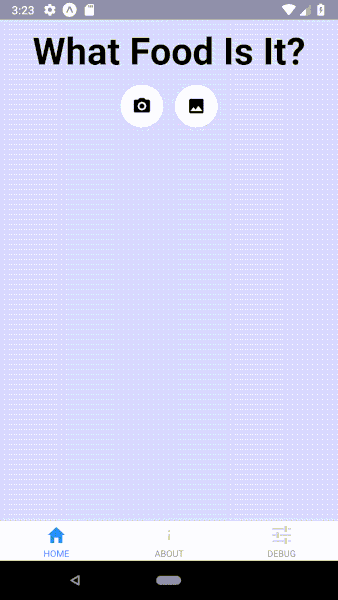

# Creating a Mobile App 

This project was completed jointly by [Nidhin Pattaniyil](https://www.linkedin.com/in/nidhinpattaniyil/) and [Reshama Shaikh](https://reshamas.github.io).

The following were used for mobile model **deployment**:    
1.  Expo
2.  XCode (optional)

Here is a link to a demo of our mobile app on [YouTube](https://www.youtube.com/watch?v=7d2qFLeYvRc&t=1s)

## Assumptions
Assumptions:  
- a deep learning model served as a web app that responds to 
Here is a sample web app:
It needs these endpoints:  
/api/classify

Input:  
1.  food-classifier repo (which has the `final.pth` file)
OR
2.  a web app model trained using any other deep learning library

## Setup 
- Update [config.js](https://github.com/npatta01/mobile-deep-learning-classifier/blob/master/config.js) with developer name, app name, app description
   
## Runnng on iOS or Android

## This was used for mobile deployment:  
1.  Expo
2.  XCode (optional)

## HOLD for SCREENSHOTS of MOBILE App

 
