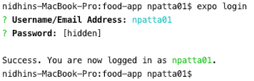
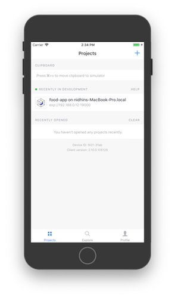
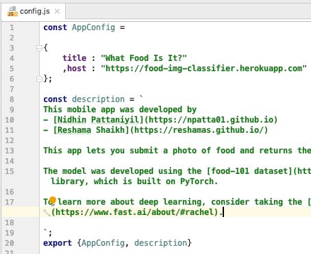

# Expo

Expo is a mobile cross platform built on top of react native.

The guide below walks you through getting expo installed and running your app on your device.


## Setup
To develop locally, you will [Node](https://nodejs.org/en/) and [Expo](https://expo.io/tools#client) installed

1) Install Node 
A) Mac/Linux
We will install node using [NVM](https://github.com/creationix/nvm)
```
curl -o- https://raw.githubusercontent.com/creationix/nvm/v0.33.11/install.sh | bash
# comment
nvm install node 
nvm use node
source ~/.bash_profile
```

B) Windows
Download through official installer [Link](https://nodejs.org/en/download/)


2) Install Expo
Expo is a wrapper build on top of React Native; a cross platform mobile framework.
It can be installed with the below command.
```
npm install -g expo-cli
```

3) Install packages for project
NPM Packages that you need for your application are specified in [package.json](package.json).
To install the packages, run
```
npm install
```

4) Expo Setup
Download [Android](https://play.google.com/store/apps/details?id=host.exp.exponent&hl=en_US) or [IOS](https://itunes.apple.com/us/app/expo-client/id982107779?mt=8) App from the respective mobile stores

Login to the expo app.


Completing this step will allow code that we developed locally to be updated on the device

5) Launch App
Login to expo on your computer
```
expo login
```



Launch expo
```
npm run start
```
You should see this project your listed on the app



6) Customizing message
Modify [config.js](../config.js)    

  
Modify "title", to change the copy listed on the "Home" screen     
Modify "host" to point to a deployed version of your model
Modify "description" to change the copy on the "About" screen


## Custom Endpoint
If you want to point your app your api, it needs these endpoints.

/api/classes    Return a list of classes
/api/classify   Takes image data as binary and returns classes

[Here](https://github.com/npatta01/food-classifier/blob/master/src/app.py) is a sample implementation.


## Deploying to the store (optional)
If you are interested in deploying to Google, and Apple refer to this [guide](3_app_store.md)


